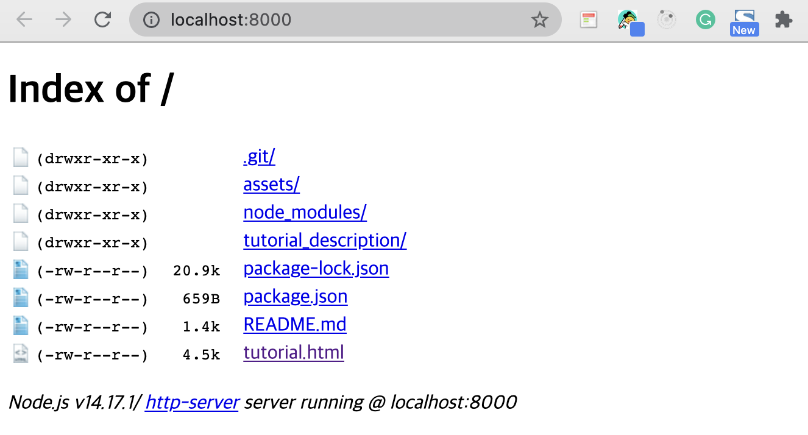
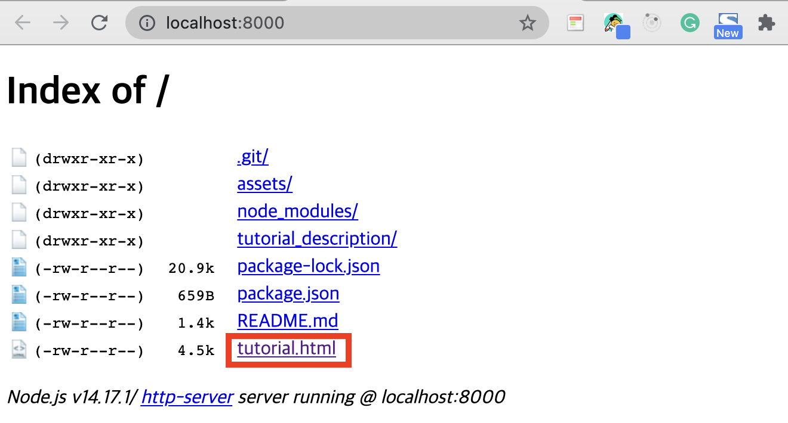

# A. 개발환경 세팅하기

- `npm` 환경을 세팅한다.

```jsx
npm init
```

- 간단한 테스트 서버 환경 구축을 위해 `http-server`를 설치한다.

```jsx
npm i http-server
```

- `phaserJS`를 설치한다.

```jsx
npm i phaser
```

- `phaserJS` 코드를 쓸 html에 `phaser` 스크립트를 추가한다.

```html
<!--tutorial.html-->

<html>
  <head>
    <meta charset="UTF-8" />
    <script src="//cdn.jsdelivr.net/npm/phaser@3.11.0/dist/phaser.js"></script>
  </head>
  <body>
    <script type="text/javascript"></script>
  </body>
</html>
```

- `package.json`에 `start` 명령어를 추가한다.

```json
//package.json
{
  "name": "phaser-tutorial",
  "version": "1.0.0",
  "description": "phaser의 기본을 익혀보자!",
  "main": "index.js",
  "scripts": {
    //start 추가
    "start": "./node_modules/.bin/http-server -a localhost -p 8000 -c-1"
  }
}
```

<br />

# B. 서버 실행시키기

- `package.json`에 `start`명령어를 추가했으니, 아래와 같이 입력하면 `http` 서버가 실행된다.

```json
npm start
```

- 서버를 실행하면 [localhost:8080](http://localhost:8080)이 켜진다.
- 해당 주소로 가면 아래 그림과 같이 폴더구조로 나타난다.



- 우리는 `tutorial`을 실행시켜야 하므로, `tutorial.html`을 클릭하면 해당 파일이 실행된다.


