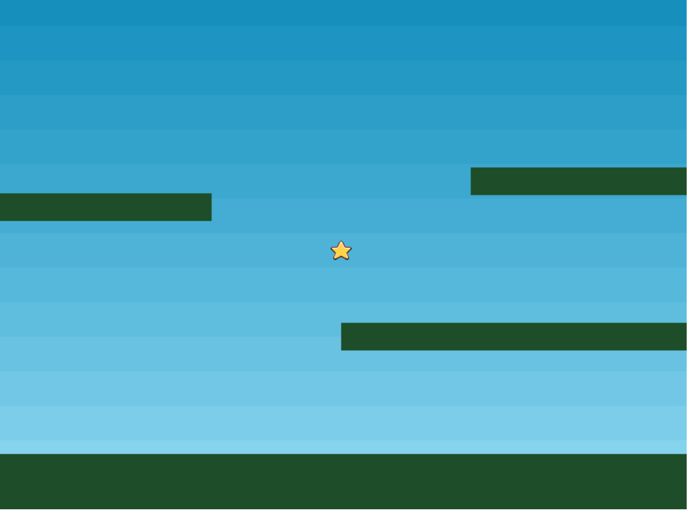

# A. Phaser 기본 구조

- 우리는 `html`에서 코드를 작성하므로 `script`에서 `phaser`코드를 추가한다.
- `phaser`의 기본 구성은 `config`변수, `preload`, `create`, `update` 함수이다.
  - **config**: 는 게임 구성 설정을 작성해야 한다.
  - **preload():** 필요한 리소스(이미지 등)을 로드한다.
  - **create()**: 추가한 리소스를 화면에 추가하거나 동작을 정의한다.
  - **update()**: 추가한 동작을 이용해 특정 이벤트를 실행시킨다.

```html
<script type="text/javascript">
  const config = {
    type: Phaser.AUTO,
    width: 800,
    height: 600,
    scene: {
      preload: preload,
      create: create,
      update: update,
    },
  };

  const game = new Phaser.Game(config);
  function preload() {}
  function create() {}
  function update() {}
</script>
```

<br />

# B. config는 게임구성 설정을 한다.

- `config` 개체는 게임을 구성하며, 렌더러, 치수 및 기본 씬 등을 설정할 수 있다.
- `type`속성은 `Phaser.CANVAS`, `Phaser.WEBGL` 또는 `Phaser.AUTO`가 가능하다.
- `AUTO`로 설정하면 기본은 `WEBGL`이며, 이를 지원하지 않을 경우 `CANVAS`로 설정된다.

```jsx
const config = {
  type: Phaser.AUTO,
  width: 800,
  height: 600,
  scene: {
    //scene에 preload, create, update함수를 등록
    preload: preload,
    create: create,
    update: update,
  },
};
```

- `Phaser.Game` 개체에 `config`를 적용하면 프로세스가 시작된다.

```jsx
const game = new Phaser.Game(config);
```

<br />

# C. 리소스 로딩하기

- 우리는 `preload()`에서 필요한 리소스(이미지 등)을 불러올 수 있다.
- 대표적으로 이미지는 `this.load.image('key값', '이미지 경로')`로 불러온다.
- 함수에서 이미지의 경우, `key값`(_문자열_)으로 불러와 사용한다.

```jsx
function preload() {
  this.load.image("sky", "assets/sky.png");
  this.load.image("ground", "assets/platform.png");
  this.load.image("star", "assets/star.png");
  this.load.image("bomb", "assets/bomb.png");
  this.load.spritesheet("dude", "assets/dude.png", {
    frameWidth: 32,
    frameHeight: 48,
  });
}
```

<br />

# D. 이미지 위치시키기

- 이미지를 장면에 나타내기 위해 `create()`에서 이미지를 추가해야한다.
- `this.add.image(x축, y축, '이미지_key값')`를 이용해서 추가한다.

```jsx
function create() {
  this.add.image(400, 300, "sky"); //이미지 추가
}
```

<br />

# E. 빌드하기

- 이미지는 어디든지 위치시킬 수 있지만, 화면(`scene`) 안에 위치시키자.
- `scene`는 어느 방향으로든 확장할 수 있으며, 크기 또한 고정되지 않는다.
- 그러므로 우리는 카메라를 이용해서 화면을 조정하면 된다.
- 일단은 여기선, 장면에 배경이미지와 땅 이미지를 추가해보자!

<br />

- 먼저, `config`에 `physics` 개체 설정을 추가한다.

```jsx
const config = {
  physics: {
    // 추가
    default: "arcade", //아케이드
    arcade: {
      gravity: { y: 300 }, //아케이드 중력 설정
      debug: false,
    },
  },
};
```

- `create()`에서 장면 설정을 한다.
- `staticGroup`을 사용하여 정적 그룹을 만들고 이 그룹에 여러 이미지를 추가할 수 있다.

```jsx
function create() {
  this.add.image(400, 300, "sky"); //이미지 추가
  this.add.image(400, 300, "star"); //이미지 추가
  platforms = this.physics.add.staticGroup(); //그룹만들기!

  //그룹에 여러가지 이미지를 생성하고 추가하기 -> 하나의 이미지 그룹임!
  platforms.create(400, 568, "ground").setScale(2).refreshBody();
  platforms.create(600, 400, "ground");
  platforms.create(50, 250, "ground");
  platforms.create(750, 220, "ground");
}
```



<br />

# F. 플렛폼 만들기

- `phaser`에서 언급하는 `body(몸체)`는 하나의 개체를 말한다.
- 우리는 `create()`에서 원하는 개체를 추가할 수 있다.

```jsx
platforms = this.physics.add.staticGroup(); //그룹만들기!
```

- `staticGroup()`은 정적 물리 그룹을 생성한다.
- 아케이드 물리엔진에는 크게 정적 그리고 동적 물리 몸체가 있다.
- 동적 몸체
  - 속도 혹은 가속도와 같은 힘을 통해 이동할 수 있는 몸체(개체)이다.
  - 우리가 실생활에서 볼 수 있는 충돌, 질량 법칙 등에 영향을 받는다.
- 정적 몸체

  - 단순히 위치, 크기만 지정되어 있다.
  - 중력의 영향 혹은 무언가가 충돌해도 움직이지 않는다.
  - 아래 코드는 정적 몸체이며, 플레이어가 뛰어다니는 지면을 만들기 적합하다.
  - 정적 몸체는 `staticGroup객체.create(너비, 높이, '이미지 키값')`으로 만든다.
    ```jsx
    function create() {
      platforms.create(400, 568, "ground").setScale(2).refreshBody();
      platforms.create(600, 400, "ground");
      platforms.create(50, 250, "ground");
      platforms.create(750, 220, "ground");
    }
    ```
  - 만약 이 정적 몸체를 확대하고 싶다면 `setScale(2)`를 사용한다.
  - 대신 정적본체의 크기를 조정하면(확대 등), `refreshBody`를 꼭 해줘야 한다. <br/>
    (물리 세계에게 `**refreshBody`로\*\* 정적 본체를 변형했다는 걸 꼬옥!!! 알려줘야 함!)

<br/><br/>

_위 과정을 거치며 코드는 아래와 같은 형태가 된다._

```jsx
const config = {
  type: Phaser.AUTO,
  width: 800,
  height: 600,
  scene: {
    preload: preload,
    create: create,
    update: update,
  },
};
const game = new Phaser.Game(config);

function preload() {
  this.load.image("sky", "assets/sky.png");
  this.load.image("ground", "assets/platform.png");
  this.load.image("star", "assets/star.png");
  this.load.image("bomb", "assets/bomb.png");
  this.load.spritesheet("dude", "assets/dude.png", {
    frameWidth: 32,
    frameHeight: 48,
  });
}

function create() {}
function update() {}
```
