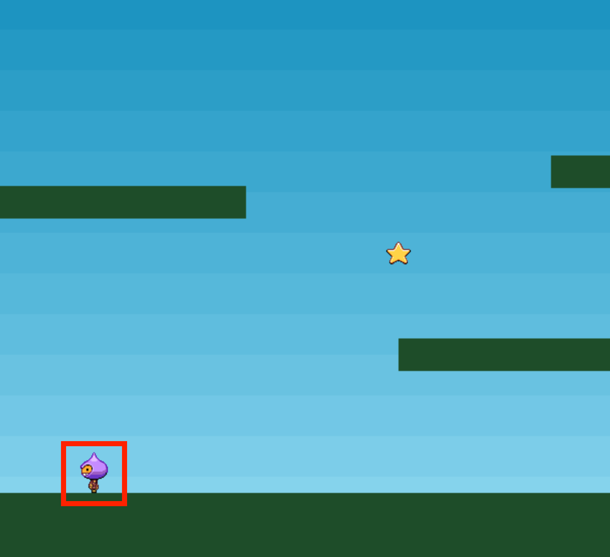

# A. 플레이어 이미지 준비하기


- 보시다시피 플레이어 이미지는 9개의 프레임을 가진 형태이다.
- 좌측 4개는 왼쪽 이동을 위한 프레임, 우측 4개는 오른쪽 이동을 위한 프레임이다. <br/>
  _(좌&우 프레임을 만들지 않고, 한 방향만 만들고 뒤집어서 사용하는 방법도 있음)_

<br/>

# B. 플레이어 이미지 추가하기


- 이렇게 프레임을 가지고 애니메이션을 추가하는 이미지는 다른 방식으로 로드해야한다.
- `this.add.image` 와 `this.load.spritesheet`의 차이는 `sprite`는 애니메이션을 부여할 수 있는 점이다.
- 만약 사용자의 인터렉션에 의한 애니메이션이 필요한 이미지는 아래 두 함수를 써야 한다.
  - `this.load.spritesheet`로 이미지 개체를 로드한다.
  - `this.physics.add.sprite(x축, y축, 이미지키값)`을 사용해 화면에 추가한다.
  - (`*add.sprite`를 사용한다는 건, 결국 동적 몸체를 사용한다는 말\*)

```jsx
function preload() {
  //이미지 개체 로드하기
  this.load.spritesheet("dude", "assets/dude.png", {
    frameWidth: 32,
    frameHeight: 48,
  });
}
```

```jsx
function create() {
  //x축 100, y축 450에 dude이미지를 화면에 추가함
  player = this.physics.add.sprite(100, 450, 'dude');
  ...
```

- `setBounce`는 점프 후 착지할 때 약간의 바운스를 준다.

```jsx
function create() {
  ...
  player.setBounce(0.2);
}
```

- 플레이어 몸체에 중력을 얼만큼 줄 건지 설정한다.
- 값이 높을 수록 물체가 무거워지고 더 빨리 떨어진다.

```jsx
function create() {
  ...
  player.body.setGravityY(300);
}
```

- 이 플레이어 개체가 어떤 지점에서 바운스할건지 설정한다.
- true를 하면 충돌하는 개체를 기준으로 바운스를 한다.

```jsx
function create() {
  ...
  player.setCollideWorldBounds(true);
}
```

<br/>

# C. 플레이어의 애니메이션 지정하기

- `this.anims.create()`을 사용해 애니메이션(동작)을 만들 수 있다.
  - **key**: key값으로, 다른 곳에서 이 값으로 동작을 가져올 수 있다.
  - **frames**: `start ~ end`까지의 이미지 프레임을 쓴다고 정의한다.
  - **frameRate**: 초당 몇 프레임으로 실행할지 설정한다.
  - **repeat**: -1을 하면 반복한다.

```jsx
function create () {
  ...
  this.anims.create({
    key: 'left',
    frames: this.anims.generateFrameNumbers('dude', { start: 0, end: 3 }),
    frameRate: 10,
    repeat: -1
  });
  ...
```

```jsx
this.anims.create({
  key: "right",
  frames: this.anims.generateFrameNumbers("dude", { start: 5, end: 8 }),
  frameRate: 10,
  repeat: -1,
});
```

```jsx
this.anims.create({
  key: "turn",
  frames: [{ key: "dude", frame: 4 }],
  frameRate: 20,
});
```

- 생성한 플레이어가 아래 그림과 같이 땅위에 서 있길 바란다면 특정 코드를 추가해야 한다.



- 바로 `this.physics.add.collider(대상1, 대상2)` 이다.
- 이 함수는 사용하면, `대상1`*(플레이어)*이 `대상2`*(platforms)*이 충돌하게 된다.
- 충돌 설정을 하면 플레이어가 platforms 위에 있을 수 있다.

```jsx
this.physics.add.collider(player, platforms);
```

<br/>

# D. 키보드로 컨트롤하자

- `update()`에서 설정한다.
- `this.input.keyboard.createCursorKeys()`를 사용하여 키보드 이벤트를 설정한다.
- `setVelocityX(값)`은 몸체의 수평 속도를 지정할 수 있다.
- `대상.anims.play('anims키값', true)`을 사용하여, 대상의 애니메이션 동작(_anims_)을 지정할 수 있다.

```jsx
function update (){
  cursor = this.input.keyboard.createCursorKeys(); //키보드 이벤트
  if (cursor.left.isDown) {      //좌측키 클릭시
    player.setVelocityX(-160);
    player.anims.play('left', true);
  }else if (cursor.right.isDown) {
    player.setVelocityX(160);    //우측키 클릭시
    player.anims.play('right', true);
  }
 ...
}
```

- 하지만 위 두 개의 동작만 지정하면, 플레이어 몸체가 끝도없이 움직인다;;
- 위 두개의 키 동작 이외에는 멈춰야 있어야 하므로, 아래와 같이 속도를 0으로 지정해준다.

```jsx
function update () {
  ...
  else {
    player.setVelocityX(0);
    player.anims.play('turn');
  }
   ...
}
```

- 점프의 경우 `setVelocityY`를 사용하면 되는데, 플레이어 몸체는 중력을 받고 있으므로 up 이벤트만 지정해주면 된다.

```jsx
function update () {
 ...
  if (cursor.up.isDown && player.body.touching.down){
    player.setVelocityY(-330);
  }
}
```

<br/><br/>

_현재까지의 코드는 아래와 같다._

```jsx
const config = {
  type: Phaser.AUTO,
  width: 800,
  height: 600,
  physics: {
    default: "arcade",
    arcade: {
      gravity: { y: 300 },
      debug: false,
    },
  },
  scene: {
    preload: preload,
    create: create,
    update: update,
  },
};

let player, platforms;
const game = new Phaser.Game(config);

function preload() {
  this.load.image("sky", "assets/sky.png");
  this.load.image("ground", "assets/platform.png");
  this.load.image("star", "assets/star.png");
  this.load.image("bomb", "assets/bomb.png");
  this.load.spritesheet("dude", "assets/dude.png", {
    frameWidth: 32,
    frameHeight: 48,
  });
}

function create() {
  this.add.image(400, 300, "sky");

  platforms = this.physics.add.staticGroup();

  platforms.create(400, 568, "ground").setScale(2).refreshBody();

  platforms.create(600, 400, "ground");
  platforms.create(50, 250, "ground");
  platforms.create(750, 220, "ground");

  player = this.physics.add.sprite(100, 450, "dude");

  player.setBounce(0.2);
  player.setCollideWorldBounds(true);

  this.anims.create({
    key: "left",
    frames: this.anims.generateFrameNumbers("dude", { start: 0, end: 3 }),
    frameRate: 10,
    repeat: -1,
  });

  this.anims.create({
    key: "turn",
    frames: [{ key: "dude", frame: 4 }],
    frameRate: 20,
  });

  this.anims.create({
    key: "right",
    frames: this.anims.generateFrameNumbers("dude", { start: 5, end: 8 }),
    frameRate: 10,
    repeat: -1,
  });
}

function update() {}
```
