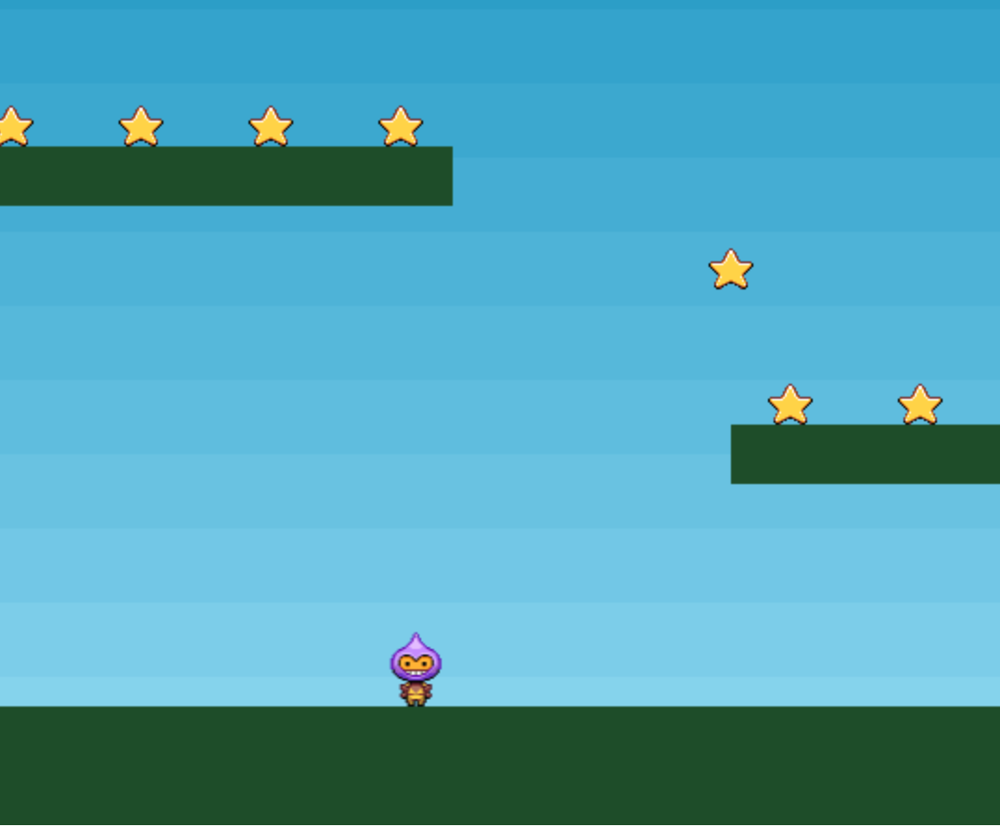

# A. 별을 주변에 뿌려보자

- 별들을 화면에 뿌리고 플레이어가 이 별들을 수집하게 해야 한다.
- 먼저 우리는 `create()`에서 `stars`라는 그룹을 만들고, 반복문을 돌린다.
- `this.physics.add.group()`을 사용하여 개체를 그룹에 추가할 수 있다.
  - **key**: 이미지 키값
  - **repeat**: 반복횟수
  - **setXY** <br/>
    : 그룹이 화면에 생성될 때, 그 그룹의 자식들의 위치를 설정할 때 사용한다. <br/>
    : 만약 x를 12로 설정하고, stepX를 70으로 주면 12, 12+70, ... 으로 위치하게 된다.

```jsx
function create() {
	  stars = this.physics.add.group({
	  key: 'star',
	  repeat: 11,
	  setXY: {x: 12, y: 0, stepX: 70}
	});
	...
```

- `그룹.children.iterate`를 사용하여 각각의 자식에 대한 설정을 할 수 있다.
- 아래 코드에서는 각각 child의 `setBounceY`를 설정했다.

```jsx
	...
	stars.children.iterate(function(child) {
	  child.setBounceY(Phaser.Math.FloatBetween(0.4, 0.8));
	})
```

- 추가한 별그룹이 `platforms`에 충돌하여 안착하기를 위하므로 `collider(별그룹, 충돌대상)`을 실행한다.

```jsx
	...
	this.physics.add.collider(stars, platforms);
```

- `this.physics.add.overlap`은 특정 대상들끼리 겹치는지 여부를 설정한다.
- `overlap(대상1, 대상2, 겹칠시 동작, null, this);`

```jsx
	...
	this.physics.add.overlap(player, stars, collectStar, null, this);
}
```

- `collectStar`는 플레이어와 별이 겹칠 때 별이 사라지도록 한다.(`disableBody`)

```jsx
function collectStar(player, star) {
  star.disableBody(true, true);
}
```



<br />

# B. 스코어 설정을 하자

- 스코어 설정을 위한 글자 배치는 `create`에서 하고, 점수 합산은 `collectStar()`에서 한다.
- 점수용(`score`), 점수 글자용(`scoreText`) 변수를 전역으로 선언한다.

```jsx
let score = 0;
let scoreText;
```

- `create()`에서 글자 크기, 문구를 설정한다.
- `this.add.text(x, y, '문구', { 글자 크기 등 css 속성 설정 })`

```jsx
function create() {
  scoreText = this.add.text(16, 16, "score: 0", {
    fontSize: "32px",
    fill: "#000",
  });
}
```

- `collectStar`에서 점수 합산을 하고 `setText`를 사용해 글자를 수정해준다.

```jsx
function collectStar(player, star) {
  star.disableBody(true, true);
  score += 10;
  scoreText.setText("Score: " + score);
}
```


<br/><br/>

_지금까지의 코드는 아래와 같다.(끝!)_

```jsx
const config = {
  type: Phaser.AUTO,
  width: 800,
  height: 600,
  physics: {
    default: "arcade",
    arcade: {
      gravity: { y: 300 },
      debug: false,
    },
  },
  scene: {
    preload: preload,
    create: create,
    update: update,
  },
};

let player, stars, platforms, cursors, scoreText;
let score = 0;
const game = new Phaser.Game(config);

function preload() {
  this.load.image("sky", "assets/sky.png");
  this.load.image("ground", "assets/platform.png");
  this.load.image("star", "assets/star.png");
  this.load.image("bomb", "assets/bomb.png");
  this.load.spritesheet("dude", "assets/dude.png", {
    frameWidth: 32,
    frameHeight: 48,
  });
}

function create() {
  this.add.image(400, 300, "sky");
  platforms = this.physics.add.staticGroup();
  platforms.create(400, 568, "ground").setScale(2).refreshBody();
  platforms.create(600, 400, "ground");
  platforms.create(50, 250, "ground");
  platforms.create(750, 220, "ground");

  player = this.physics.add.sprite(100, 450, "dude");
  player.setBounce(0.2);
  player.setCollideWorldBounds(true);

  this.anims.create({
    key: "left",
    frames: this.anims.generateFrameNumbers("dude", { start: 0, end: 3 }),
    frameRate: 10,
    repeat: -1,
  });
  this.anims.create({
    key: "turn",
    frames: [{ key: "dude", frame: 4 }],
    frameRate: 20,
  });
  this.anims.create({
    key: "right",
    frames: this.anims.generateFrameNumbers("dude", { start: 5, end: 8 }),
    frameRate: 10,
    repeat: -1,
  });

  cursors = this.input.keyboard.createCursorKeys();
  stars = this.physics.add.group({
    key: "star",
    repeat: 11,
    setXY: { x: 12, y: 0, stepX: 70 },
  });
  stars.children.iterate(function (child) {
    child.setBounceY(Phaser.Math.FloatBetween(0.4, 0.8));
  });

  scoreText = this.add.text(16, 16, "score: 0", {
    fontSize: "32px",
    fill: "#000",
  });

  this.physics.add.collider(player, platforms);
  this.physics.add.collider(stars, platforms);
  this.physics.add.overlap(player, stars, collectStar, null, this);
}

function update() {
  if (cursors.left.isDown) {
    player.setVelocityX(-160);
    player.anims.play("left", true);
  } else if (cursors.right.isDown) {
    player.setVelocityX(160);
    player.anims.play("right", true);
  } else {
    player.setVelocityX(0);
    player.anims.play("turn");
  }
  if (cursors.up.isDown && player.body.touching.down) {
    player.setVelocityY(-330);
  }
}

function collectStar(player, star) {
  star.disableBody(true, true);
  score += 10;
  scoreText.setText("Score: " + score);
}
```
